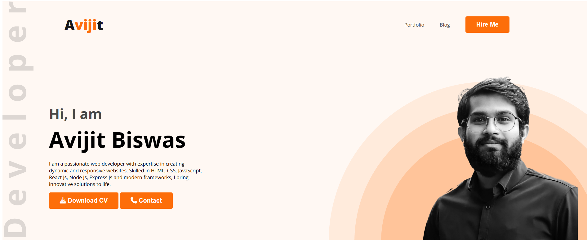
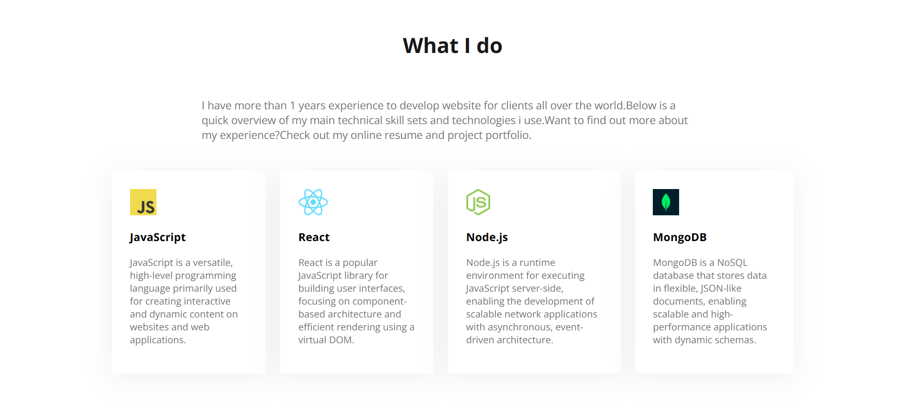

# 👨‍💻 AB Portfolio – Responsive Web Page

[🔗 Live Demo](https://devo-ab.github.io/ab-portfolio)

This is my **Personal Portfolio** website built using **HTML** and **CSS**. It’s fully responsive and designed to present my personal and professional identity clearly across all devices.

---

## ✨ Features

- ✅ Responsive navbar
- ✅ Hero/banner section with personal photo
- ✅ About Me section
- ✅ "What I Do" services summary
- ✅ Resume summary
- ✅ Contact form
- ✅ Clean and professional layout

---

## 🛠️ Tech Stack

- **HTML5**
- **CSS3**

---

## 📁 Folder Structure

```
ab-portfolio/
├── assets/
│   ├── background/         # Background images
│   ├── favicon/            # Favicon
│   ├── images/             # General images used in the webpage
│   ├── logo/               # Logo files
├── css/                    # Stylesheets (style.css)
├── preview/                # Screenshots for README
├── index.html              # Main landing page
└── README.md               # Project documentation
```

## 📸 Screenshots

### 🖼️ Banner Section



### 🖼️ Details


### 🖼️ Full Preview


---

## 🚀 Run Locally

To run this project on your machine:

```bash
git clone https://github.com/devo-ab/ab-portfolio.git
cd ab-portfolio
 ```

🌐 Deployment
This project is deployed using GitHub Pages.

Deploy in 3 steps:
Push the project to GitHub

Go to Settings > Pages

Select branch: main and folder: / (root) — then click Save

# 👤 Author

# Avi Jit

## :mailbox: Reach me out

<p align="left">
<a href="https://linkedin.com/in/itsavijitb" target="blank"></a>
<a href="https://twitter.com/itsavijitb" target="blank"></a>
<a href="https://facebook.com/itsavijitb" target="blank"></a>
<a href="https://instagram.com/itsavijitb" target="blank"></a>
</p>